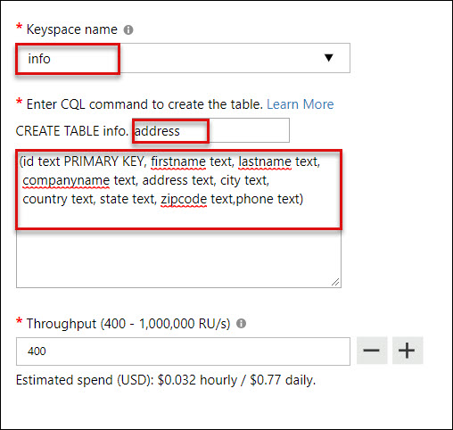
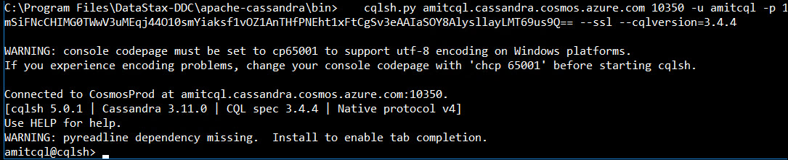
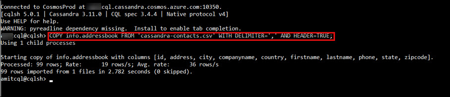

# Introduction to CosmosDB-Cassandra API.md

## 1. Create a database account

Before you can create a document database, you need to create a Cassandra account with Azure Cosmos DB.

1. In a new browser window, sign in to the Azure portal.

2. Select Create a resource > Databases > Azure Cosmos DB.

3. In the Create Azure Cosmos DB Account page, enter the settings for the new Azure Cosmos DB account.<br/>
<br/>

   Click on **Review and Create**<br/>
<br/>

4. The account creation takes a few minutes. Wait for the portal to display the page saying Congratulations! Your Azure Cosmos DB account was created.<br/>

## 3. Create Keysapce and Table 

You need to create a keyspace and table for inserting and querying the the data using CQL.

1. In a new browser window, sign in to the Azure portal.

2. Click on Azure Cosmos DB icon, then select your azure cosmos db and click on Data Explore. Click on **New Keyspace** and give the setting values as per below:

<br/>

3. Once your **KeySpace** is ready, click on **New Table** for creating table and provide following instuctions :

<br/>


## 2. Upload and Query sample data using cql

1.	Launch Windows RDP and Download CSV from https://experienceazure.blob.core.windows.net/software/cassandra-contacts.csv.

2.	Launch Command Promote as Admin.

3. Change the directory using folowing command: <br/>
```
cd C:\Program Files\DataStax-DDC\apache-cassandra\bin
```
4. Run the following command
```
cqlsh.py amitcql.cassandra.cosmos.azure.com 10350 -u amitcql -p 1mSiFNcCHIMG0TWwV3uMEqj44O10smYiaksf1vOZ1AnTHfPNEht1xFtCgSv3eAAIaSOY8AlysllayLMT69us9Q== --ssl --cqlversion=3.4.4
```
<br/>
5. Use following command to uploading data to azure cosmos db:

```
COPY info.addressbook FROM 'cassandra-contacts.csv' WITH DELIMITER=',' AND HEADER=TRUE;
```
<br/>

6. Launch the Azure Portal, go to your azure cosmos db account, select Data Explorer and refresh the data. You will see that the data has been uploaded.

<br/>
7. Click on Rows > CQL Query Text and Click Run

<br/>
