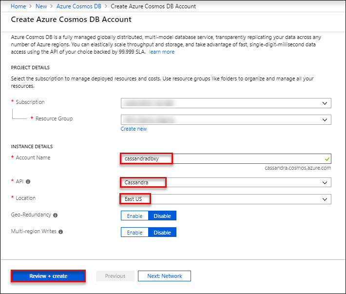
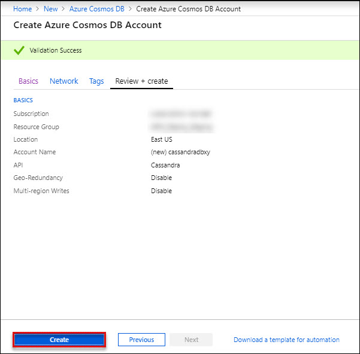
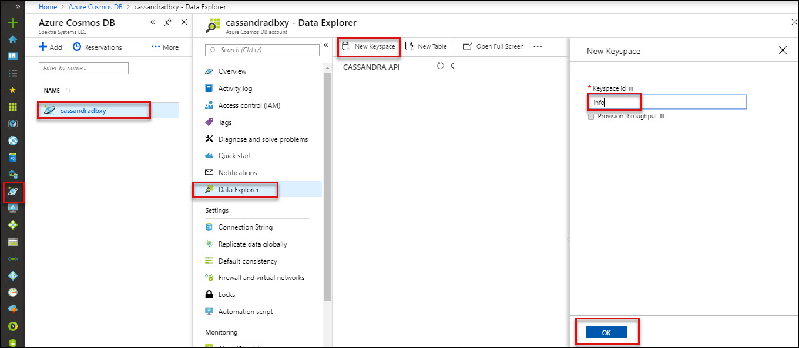
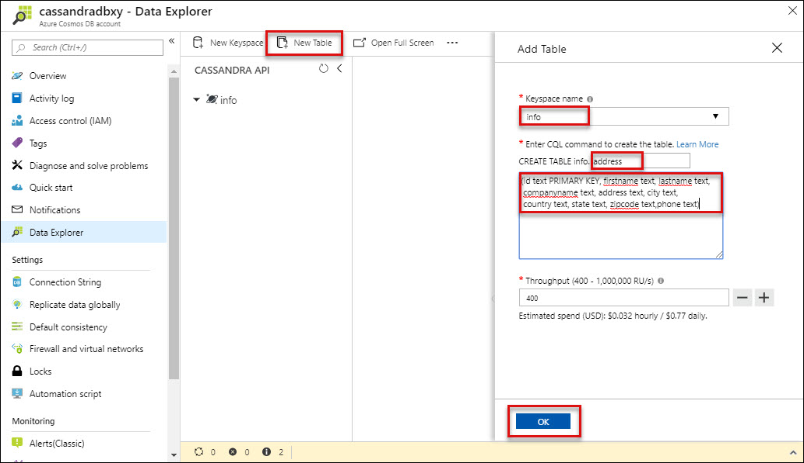
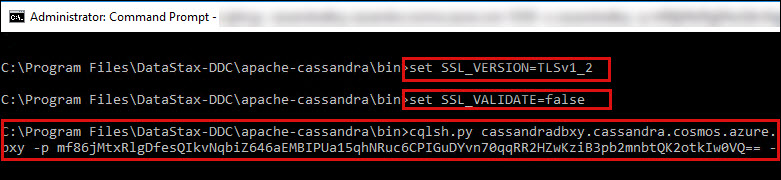
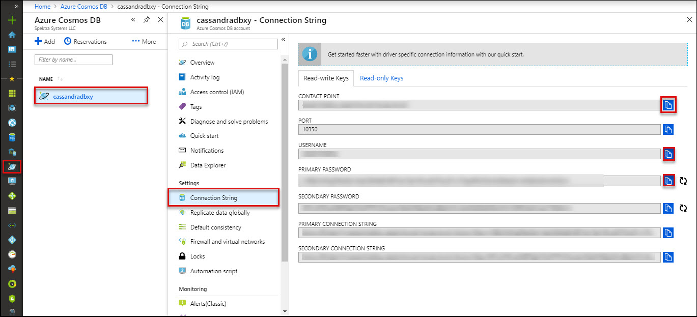
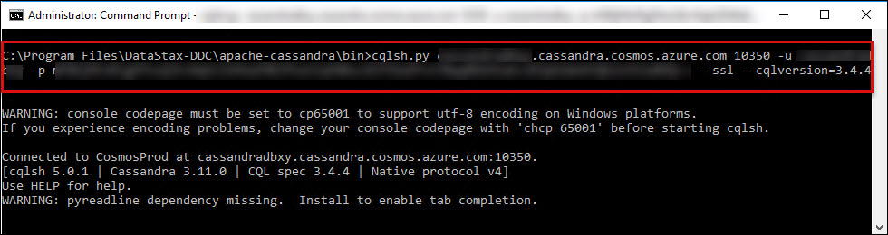
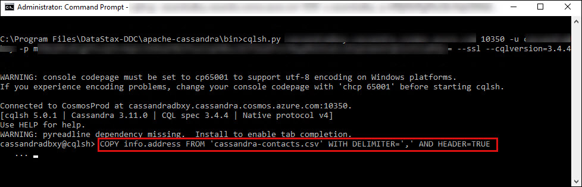
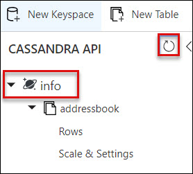
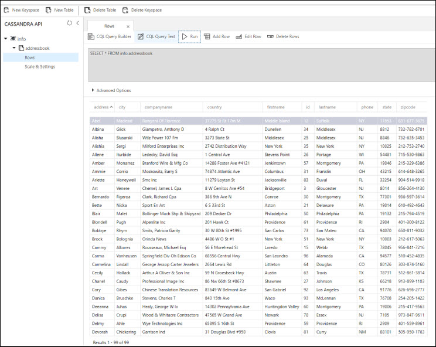

# Introduction to CosmosDB-Cassandra API.md

## 1. Create a database account

Before you can create a document database, you need to create a Cassandra account with Azure Cosmos DB.

1. In a new browser window, sign in to the Azure portal.

2. Select Create a resource > Databases > Azure Cosmos DB.

3. In the Create Azure Cosmos DB Account page, enter the settings for the new Azure Cosmos DB account.<br/>
<br/>

   Click on **Review and Create**<br/>
<br/>

4. The account creation takes a few minutes. Wait for the portal to display the page saying Congratulations! Your Azure Cosmos DB account was created.<br/>

## 2. Create Keysapce and Table 

You need to create a keyspace and table for inserting and querying the the data using CQL.

1. In a new browser window, sign in to the Azure portal.

2. Click on Azure Cosmos DB icon, then select your azure cosmos db and click on Data Explore. Click on **New Keyspace** and give the setting values as per below:

<br/>

3. Once your **KeySpace** is ready, click on **New Table** for creating table and provide following instuctions :<br/>

a. Keyspace Name : **info**<br/>
b. Create Table info : **address**<br/>
c. Query :<br/>

```
(id text PRIMARY KEY, firstname text, lastname text, companyname text, address text, city text, country text, state text, zipcode text,phone text)
```

<br/>


## 3. Upload and Query sample data using cql

1.	Launch Windows RDP and Download CSV from https://experienceazure.blob.core.windows.net/software/cassandra-contacts.csv.

2.	Launch Command Promote as Administrator.

3. Change the directory using folowing command: <br/>
```
cd C:\Program Files\DataStax-DDC\apache-cassandra\bin
```
4. Run the following commands for SSL certification <br/>
```
set SSL_VERSION=TLSv1_2
set SSL_VALIDATE=false

```
<br/>

5. Go to Azure cosmos db, select the connection string and copy **CONTACT POINT**, **USERNAME** and **PRIMARY PASSWORD**. Paste these values for use in Notepad.<br/>

<br/>

6. Run the following command for connecting to Azure cosmos Cassandra API.<br/>

```
cqlsh.py <CONTACT POINT> -u <USERNAME> -p <PRIMARY PASSWORD> --ssl --cqlversion=3.4.4
```
<br/>
7. Use following command to uploading data to azure cosmos db:<br/>

```
COPY info.address FROM 'cassandra-contacts.csv' WITH DELIMITER=',' AND HEADER=TRUE;
```
<br/>

8. Launch the Azure Portal, go to your azure cosmos db account, select Data Explorer and refresh the data. You will see that the data has been uploaded.<br/>

<br/>
8. Click on Rows > CQL Query Text and Click Run<br/>

<br/>
